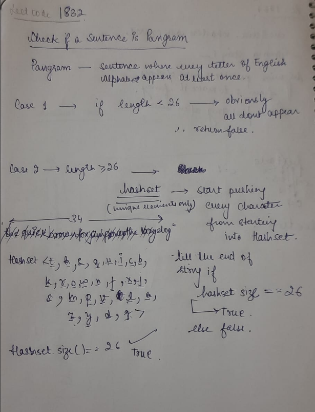

## Problem : [Leetcode 1832_easy ](https://leetcode.com/problems/check-if-the-sentence-is-pangram/description/)

## Solution :



## Code in Java :

```
class Solution {
    public boolean checkIfPangram(String sentence) {
        if (sentence.length()<26){
            return false ;
        }
        
        HashSet<Character> set = new HashSet<>();

        for(int i = 0 ; i< sentence.length() ; i++){
            set.add(sentence.charAt(i));
        }

        return set.size()==26 ; 
    }

}
```

**Time Complexity : O(n)** 

