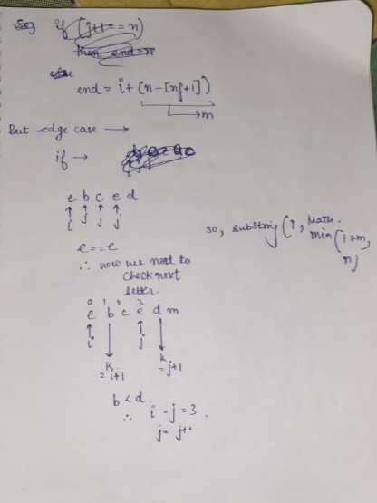

## Problem : [Leetcode 3403 medium ](https://leetcode.com/problems/find-the-lexicographically-largest-string-from-the-box-i/description/?envType=problem-list-v2&envId=string)

## Solution : 

Code in java ->

`class Solution {

    public static int bestIndex(String w, int nf) {
        int n = w.length();
        int i = 0;
        int j = 1;

        while (j < n) {
            if (w.charAt(i) < w.charAt(j)) {
                i = j;
            } 
            else if (w.charAt(i) == w.charAt(j)) {
                int k = i + 1;
                int p = -1 ;
                if(j != n - 1) {
                    p = j + 1;
                } 

                while (k != j && p < n) {
                    if(p==-1){
                        break ; 
                    }
                    else if (w.charAt(k) < w.charAt(p)) {
                        i = j;
                        break;
                    } 
                    else if (w.charAt(k) > w.charAt(p)) {
                        break;
                    }
                    k++;
                    p++;
                }
            }
            j++;
        }
        return i;
    }

    public String answerString(String word, int numFriends) {
        
        int n = word.length();
        int maxPosLen = n - numFriends + 1;
        if (numFriends==1){
            return word ; 
        }
        int index = bestIndex(word, numFriends);
        

        return word.substring(index, Math.min(index + maxPosLen, n));
    }
}
`
## Best case  - O(n)
## Worst case - O(n^2)
